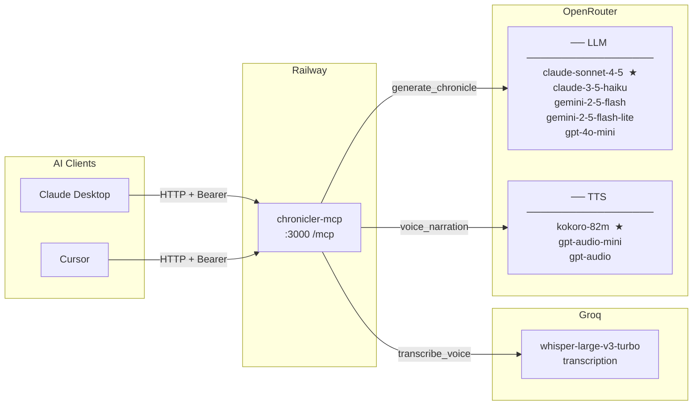
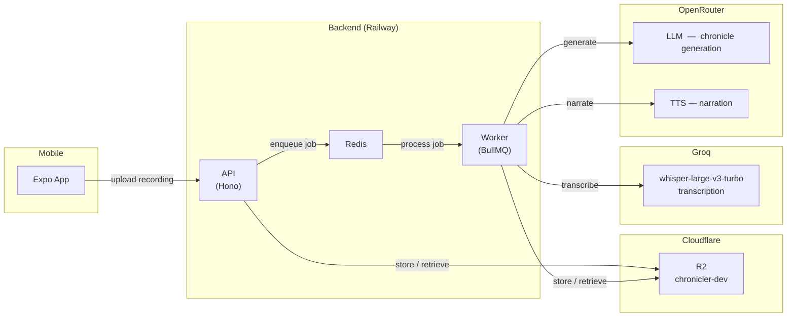

# Chronicler — Service Architecture

## MCP Server (deployed)

**★ = current default model**

---

## Backend pipeline (Phase 1 — in progress)

---

## Model registry

Both LLM and TTS models are managed as named registries in `packages/core`. Switching the active model is a one-line change — no tool logic to touch.

| Registry | File |
|---|---|
| LLM | `packages/core/src/llm/openrouter-models.ts` |
| TTS | `packages/core/src/tts/openrouter-models.ts` |
