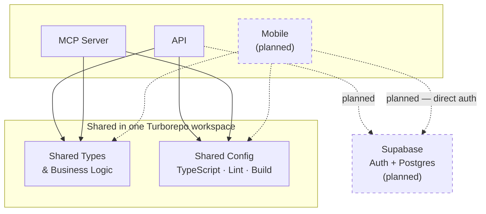
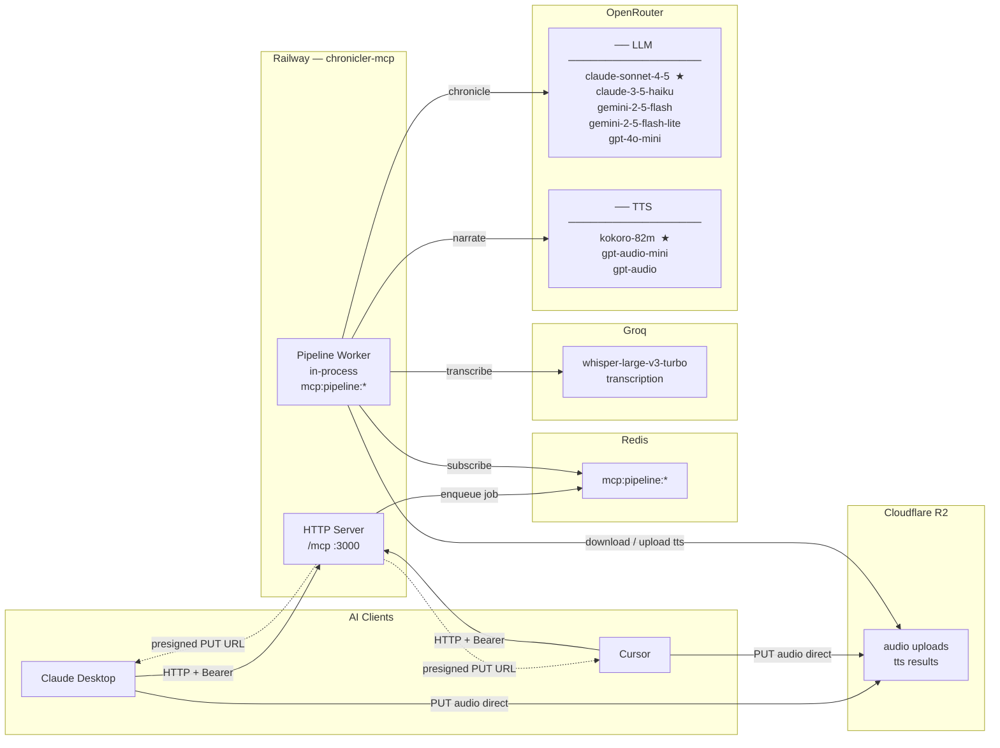
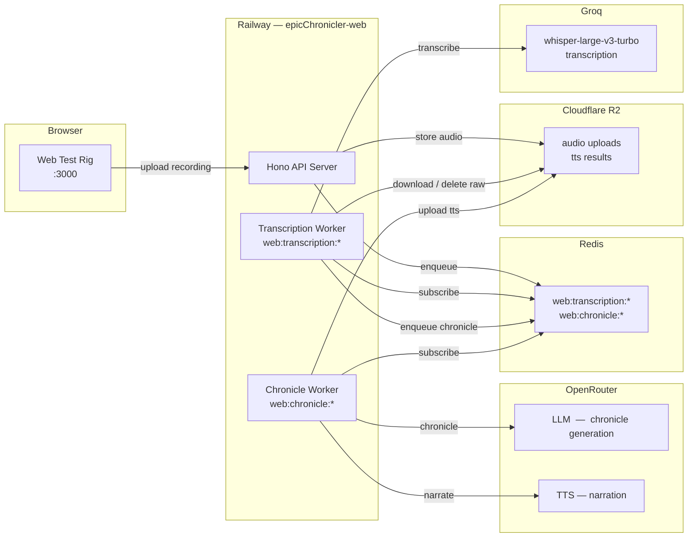

# Chronicler — Service Architecture

## Monorepo Layout

Current workspace members, the build/task graph, and the infrastructure each app talks to. Dashed nodes and edges are projected — not built yet. Rationale for Turborepo is in `docs/SDD.md` §7.3.

**Note:** the Docker deploy path (`Dockerfile.api`, `Dockerfile.mcp`) bypasses `turbo build` and calls `pnpm --filter @chronicler/core build` directly — see SDD §7.3 for why.

---

## MCP Server (deployed)

Each AI client calls `create_audio_upload` to get a presigned R2 URL, uploads the audio file directly to R2, then calls `process_audio` to enqueue the job. The pipeline worker runs in-process alongside the HTTP server.

**★ = current default model**

Audio never passes through the HTTP server — the client writes directly to R2 via the presigned URL, keeping the server stateless and the upload fast.

---

## Web App (deployed)

The API server and both BullMQ workers run in the same Railway service. There is no separate worker deployment.

---

## Queue isolation

Both Railway services share the same Redis instance. Redis key prefixes enforce ownership so workers from one service never consume jobs enqueued by the other.

| Redis key pattern | Owner |
|---|---|
| `mcp:pipeline:*` | chronicler-mcp — pipeline worker |
| `web:transcription:*` | epicChronicler-web — transcription worker |
| `web:chronicle:*` | epicChronicler-web — chronicle worker |

---

## Model registry

Both LLM and TTS models are managed as named registries in `packages/core`. Switching the active model is a one-line change — no tool logic to touch.

| Registry | File |
|---|---|
| LLM | `packages/core/src/llm/openrouter-models.ts` |
| TTS | `packages/core/src/tts/openrouter-models.ts` |
